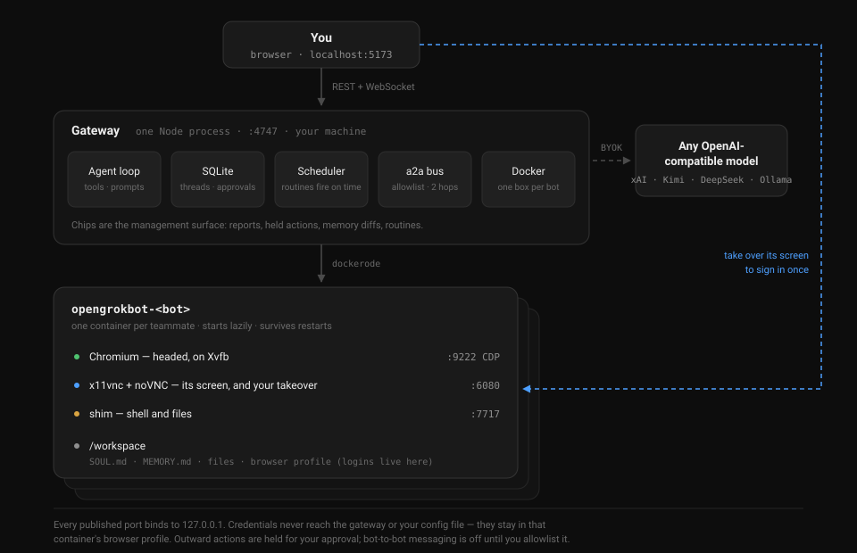

# OpenGrokBot 🦞🤖

> 自托管、开源的 Grok Bot 平替——用 [OpenClaw](https://github.com/openclaw/openclaw) + 任意模型 key，约 10 分钟拼装完成。你的 bot，你的机器，你的凭证。

[English](README.md) · [中文](README.zh-CN.md)

xAI 发布 Grok Bot 当天，Hacker News 热帖的高赞回复是：*"so like OpenClaw ???"*

没错。这个仓库就是把这句评论变成可执行版本。

## Grok Bot 卖的 vs 这套拼装出来的

Grok Bot：常驻的 AI 同事，每个 bot 一台专属云电脑（浏览器+文件系统+终端），bot 之间互发消息传递任务，跨会话记忆。价格 **$120–300/月**（SuperGrok Heavy、Cursor Ultra / Teams Premium），企业排 waitlist，而且每个 bot 都跑在 xAI 的云上——**你的账号登录态在别人机器里**。

下表左列的一切，开源世界早就有了，本仓库只是把它们接好：

| Grok Bot | OpenGrokBot 拼装 |
|---|---|
| 常驻同事，各配云电脑 | OpenClaw Gateway 守护进程，跑在**你的** Mac / 家用服务器 / $5 VPS |
| 每 bot 浏览器+文件+终端 | OpenClaw 工具集；`latest-browser` 镜像自带 Chromium |
| 具名 bot、持久记忆 | 每 agent 独立 workspace + 会话存储 |
| bot 互发消息、交接任务 | `tools.agentToAgent`，显式白名单，见 [docs/multi-bot.md](docs/multi-bot.md) |
| 专用桌面/iOS App | 用你已有的 app 聊：Telegram、微信路线图中、WhatsApp、Slack、iMessage |
| 只能用 Grok 模型 | **任意模型**：Grok API 本尊、Claude、GPT、Kimi、DeepSeek、本地 Ollama（$0） |
| 看你演示学工作流 | ❌ 唯一真实差距，见 [Roadmap](#roadmap) |
| MCP / 连接器 | MCP + skills + 插件（[ClawHub](https://clawhub.ai)） |
| $120–300/月 + waitlist | 软件 $0 + 你自己的 API 用量，无需排队 |

诚实声明：Grok Bot 的零配置、iOS App 打磨、演示学习是真实优势。如果你愿意把账号放上 xAI 的云并为省事付费，买它没错。这个仓库属于在 HN 帖里追问「你们真的放心吗？」然后摇头的那批人。

## 安全不是脚注，是卖点本身

对托管常驻 agent 最响亮的反对：一个永不休眠、握着**你全部凭证**、跑在别人基础设施上、暴露在 prompt injection 面前的 agent。

自托管的姿势：

- **凭证不出你的机器**，没有任何第三方云保管你的登录态
- **给 bot 开独立账号**，别用你自己的——独立邮箱、独立日历，按需邀请
- **默认配对制**：陌生发信人必须手动批准（`openclaw pairing approve …`）
- **可沙箱**：容器里跑 agent（`OPENCLAW_SANDBOX=1`），且三个预置 bot 自带「禁付款 / 禁外发 / 只出草稿」的硬边界
- **一切入站消息按不可信输入处理**，上线前先读 [docs/security.md](docs/security.md)

## 快速开始（本地，约 10 分钟）

```bash
git clone https://github.com/wolfqing/OpenGrokBot.git
cd OpenGrokBot
./setup.sh
```

脚本会：装 OpenClaw（官方安装器，已装则跳过）→ 问你用哪家模型（贴 xAI key 最点题：用 Grok API 拼一个开源 Grok Bot）→ 写好三个预配置同事 + agent 互通配置 → **绝不覆盖你已有的 OpenClaw 配置**（生成合并文件代替）。

然后：

```bash
openclaw onboard --install-daemon   # 首次：校验模型访问、安装守护进程
openclaw dashboard                  # 打开控制台，跟第一个同事打个招呼
```

接 Telegram / WhatsApp / Slack 各约 2 分钟：[渠道指南](https://docs.openclaw.ai/channels)。想跑服务器见 [docker/](docker/)。

## 三个开箱即用的同事

| Bot | 角色 | 内置硬边界 |
|---|---|---|
| **Scout**（researcher） | 一句话问题 → 带来源的决策简报 | 凡断言必有引用；宁说不知道不猜 |
| **Sorter**（inbox-keeper） | 转发给它的消息分诊、代拟回复、每日摘要 | **只出草稿，永不代发** |
| **Ticker**（market-watch） | 盯自选清单、早晚盘摘要、阈值告警 | 只读；永不交易；不构成投资建议 |

它们会互相交接：让 Scout 做调研，它会把价格问题转给 Ticker——通过 `agentToAgent`，在你的机器上，白名单内。示例对话见 [docs/multi-bot.md](docs/multi-bot.md)。

想改名、换人格（`SOUL.md`）、加第四个同事——它们只是 [teammates/](teammates/) 里的文件夹。

## 成本账

| | Grok Bot | OpenGrokBot |
|---|---|---|
| 软件 | $120–300/月 | $0（全链路 MIT） |
| 算力 | 含（xAI 的云） | 你现有的 Mac / 迷你主机，或 ~$5/月 VPS |
| 模型 | 含（仅 Grok） | 自带 key 任选，本地模型 = $0 |
| 排队 | 企业要 | 不用 |

中等用量单 bot 走 `grok-4.5` API 每月约几美元。三个 bot + $5 VPS + 本地兜底模型：**全月 ~$5**。

## 架构



一个 Gateway 进程，N 个隔离 agent，前面是你已有的聊天软件，后面是你选的模型。没有任何东西回传。

## Roadmap

- [ ] **teach-mode**——Grok Bot 唯一没有开源等价物的功能：录制浏览器演示 → 编译成可复用 skill，讨论见 [#1](../../issues/1)，欢迎共建
- [ ] 一键 VPS 镜像（cloud-init）
- [ ] 微信渠道配方
- [ ] 视频教程

## 与两边的关系，一次说清

- **与 Grok Bot**：功能平替，**零代码关系**——Grok Bot 闭源，无从 fork，本仓库没有任何东西源自它。复刻的是「工作」本身（常驻具名同事、持久记忆、bot 互相交接），托管模型完全相反（你的机器、你的凭证）。甚至可以用同一个大脑：接 Grok API。
- **与 OpenClaw**：**发行版**关系——OpenClaw 是引擎（网关、渠道、会话、沙箱，数百名贡献者维护，功劳归他们），OpenGrokBot 是引擎之上的产品层：安装路径、三个带硬边界的预置同事、多 bot 接线、对 Grok Bot 的诚实映射。类比 Ubuntu 之于 Linux 内核。非 OpenClaw 官方项目。

## 声明

非官方项目，与 xAI、OpenClaw Foundation 均无关联。"Grok" 是 xAI 的商标，此处仅用于指代本仓库所平替的产品。

## License

[MIT](LICENSE)。省下 $300/月的话，给个 star ⭐
